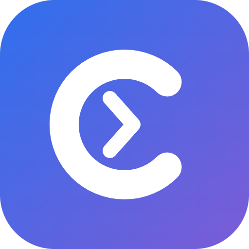

<div align="center">



# CCB · AI 编程助手一键配置

把 Trae / Qoder / CodeBuddy / WorkBuddy / Cursor / ZCode 等 AI 编程客户端一键接入 CCB —— 自动写入全部可用模型、自动设为默认模型、自动启动，打开即用。

[](https://ccb.btluo.com)

[](https://ccb.btluo.com)
[](./LICENSE)
[](https://github.com/Btluo1/ccb/stargazers)

</div>

## 项目简介

CCB 桌面端是一个面向 Windows 的「AI 编程客户端一键配置」工具：登录 CCB 账号后，选中你已经安装的客户端，点一次按钮即可完成全部接入配置。

- **一键配置并启动**：自动获取平台密钥 → 批量写入全部可用模型 → 设为当前模型 → 启动客户端（运行中的自动重启）。
- **覆盖主流客户端**：Trae / TraeCode / TraeWork、Qoder CN / QoderWork、CodeBuddy、WorkBuddy、ZCode、Cursor，共 13 个客户端或版本。
- **全部模型按官方定价 2 折计费**，按输入 / 输出 token 用量从余额扣费；兑换卡充值即时到账。
- **随时可回滚**：写入前自动备份原配置（`*.bak`），在「详情」里一键恢复原样。
- **内置帮助文档**：客户端底部「遇到问题？」帮助区，常见问题支持关键词搜索、断网可用。

> 本仓库只包含**桌面客户端**代码；账号服务、计费与 API 网关等云端代码不在开源范围内。

## 功能特性

`一键配置` `全模型自动写入` `默认模型自动切换` `自动启动 / 重启` `写入前自动备份` `一键回滚` `智能路径检测` `手动指定路径` `绿色版 / 自定义盘符支持` `应用内自动更新` `兑换卡充值` `内置问题排查文档`

## 支持的客户端

| 客户端 | 版本 | 接入方式 | 使用须知 |
| --- | --- | --- | --- |
| Trae | 国际版 | 官方自定义模型（写入 Trae 账号） | 需先在客户端登录 |
| TraeCode | 中国版 | 官方自定义模型（写入 Trae 账号） | 需先在客户端登录 |
| TraeWork | 国际版 / 中国版 | 官方自定义模型（与 Trae 共用账号） | 需先在客户端登录 |
| Qoder CN IDE | 中国版 | 预定义 provider + 本地代理重定向 | 写入后从任意入口启动均可用；回滚会清理本地代理 |
| Qoder CN | 桌面版 | 本地 worker 桥接 | 打开即用 |
| QoderWork | 国际版 / 中国版 | 本地 worker 桥接 | 首次需在客户端登录一次 |
| CodeBuddy | 中国版 | 写入模型配置 + 工作区选中模型 | 打开即用 |
| WorkBuddy / WorkBuddy AI | 中国版 / 国际版 | 写入模型配置 + 工作区状态库 | 未登录时默认模型需在模型选择器里手选一次 |
| ZCode | — | 写入供应商配置与当前模型 | 打开即用 |
| Cursor | — | 官方自定义模型（BYOK）/ 本地代理（MITM，实验） | MITM 模式需安装根证书，并在使用期间保持 CCB 运行 |

> Qoder IDE 国际版（qoder.com）因客户端聊天走自有加密协议，暂不支持接入。

## 快速开始

1. **下载安装**：到官网 [ccb.btluo.com](https://ccb.btluo.com) 下载安装版或便携版（Windows 10/11）。
2. **注册并登录**：用户名 + 密码即可，无需邮箱。
3. **充值**：在「账户余额」里输入兑换卡卡密点「兑换」，立即到账（官网可购买兑换卡）。
4. **一键配置**：选中一个客户端 → 点「一键配置并启动」→ 打开客户端即可使用。

小提示：

- Trae 系 / WorkBuddy / QoderWork 的模型保存在你的客户端账号里，请先在该客户端登录，再回到 CCB 重新点一次「一键配置并启动」。
- 模型选择器里请认准带 **CCB** 前缀的模型（形如 `CCB glm-5.3`）；客户端自带的同名模型不走 CCB 中转。

## 常见问题

<details>
<summary>配置完成后，客户端里还是原来的模型 / 找不到 CCB 模型？</summary>

在客户端模型选择器里选一次带 **CCB** 前缀的模型。若客户端是 Trae 系 / WorkBuddy / QoderWork，请先在该客户端登录，再回到 CCB 重新配置——这类客户端的模型保存在账号里，未登录时无法写入。
</details>

<details>
<summary>提示「还差一步：先在客户端登录，再回来重新配置」？</summary>

按提示先在客户端登录，然后回到 CCB 再点一次「一键配置并启动」即可。登录后模型会自动写进账号并设为当前模型。
</details>

<details>
<summary>提示余额不足 / 怎么充值？</summary>

在「账户余额」里输入兑换卡卡密点「兑换」，立即到账。全部模型按官方定价 2 折计费，按 token 用量从余额扣费；余额为 0 时配置能写入，但客户端调用模型会失败。
</details>

<details>
<summary>没检测到我的客户端 / 卡片显示「路径待核对」？</summary>

客户端装在非默认位置（自定义盘符 / 绿色版 / 便携包）时：点卡片「详情」→「手动选择路径」，选中安装目录或 `.exe` 程序。刚安装完的客户端，点第 2 步右上角「重新检测」。
</details>

<details>
<summary>Cursor 代理模式报证书错误？</summary>

在 Cursor「详情」→ 接入模式选「MITM 代理模式」后：① 点「安装根证书」（弹安全警告点「是」）② 点「重新写入配置」③ 重启 Cursor。使用期间请保持 CCB 运行。只在聊天里用 CCB 模型的话，选「官方自定义模型」模式更简单稳定。
</details>

<details>
<summary>想撤销配置 / 恢复原样？</summary>

打开对应客户端的「详情」，点「回滚」——CCB 写入前会自动备份原文件（`*.bak`），回滚完整恢复写入前的配置。
</details>

更多问题可直接使用客户端底部的「遇到问题？」帮助区（支持关键词搜索）。

## 开发与构建

环境要求：Node.js 20+、Windows 10/11。

```bash
cd desktop
npm install        # 安装依赖
npm start          # 本地运行（Electron）
npx vitest run     # 运行全部单元测试
npm run dist       # 打包 Windows 安装版 + 便携版
```

国内网络安装 Electron 较慢，可先设置镜像：

```powershell
$env:ELECTRON_MIRROR="https://npmmirror.com/mirrors/electron/"
$env:ELECTRON_BUILDER_BINARIES_MIRROR="https://npmmirror.com/mirrors/electron-builder-binaries/"
```

目录结构：

```
desktop/
├── electron/          # 主进程：客户端检测 / 配置写入 / 本地代理
│   ├── main.js        # 应用入口与 IPC
│   └── lib/           # 各客户端写入器、代理与工具模块
├── renderer/          # 界面（原生 HTML / CSS / JS，无框架）
└── test/              # 单元测试与 UI 冒烟脚本
```

## 开源范围与免责声明

- 本仓库仅包含桌面配置端（`desktop/`）；账号服务、计费、API 网关等云端代码不在开源范围内。
- 本项目是本地配置辅助工具：通过写入客户端的本地配置文件、或在本机运行代理的方式实现接入；与 Trae、Qoder、CodeBuddy、WorkBuddy、Cursor、ZCode 等厂商没有隶属或合作关系，相关商标归各自权利人所有。
- 请在各客户端服务条款允许的范围内使用本工具；因使用行为产生的一切后果由使用者自行承担。

## 许可证

[MIT](./LICENSE) © 2026 CCB